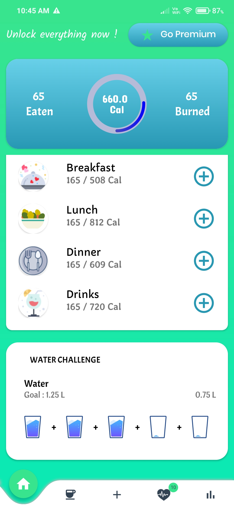
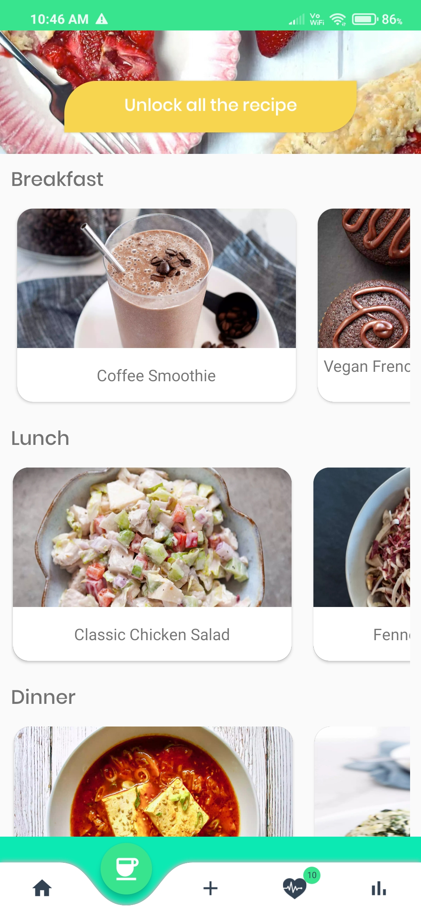

<h1 align="center"> </h1>

# **Foodvisor - Nutrition & Diet Clone 🤩🔥** 
Foodvisor is an app for adopting healthier habits and losing weight. In this clone app you have access to add and manage your daily breakfast, lunch, dinner, drinks calories data. Using this clone you can also cook or read multiple recipes with their ingredients, calories, time and all. You will find 20+ diet plans like Keto, Low Carb, Intermittent Fasting, Clean Eating, Bulk Up, Vegetarian, and more.

## Foodvisor working *[Video](https://drive.google.com/file/d/16Cu1sorftvj-CFHfXNQhweCbcHRz8n08/view?usp=sharing)*

# Let's See

  
  
  

# 🔗Open-Source Library

* [Glide](https://github.com/bumptech/glide)
* [Firebase](https://firebase.google.com/docs/auth)
* [CircleMenu](https://github.com/Ramotion/circle-menu)
* [Jetpack](https://developer.android.com/jetpack)
* [AnyChart](https://github.com/AnyChart/AnyChart-Android)
* [Meow Bottom Navigation](https://github.com/oneHamidreza/MeowBottomNavigation)

# Things I used while making this application

* GitHub
* Firebase
* Recycler View
* Retrofit Library
* JSON
* Lottie files
* Progress bar
* Webview
* AnyChart
* CircleMenu
* Fragments
* Navigation
* Meow Bottom Navigation

# Tech Stack ✨

* [Android Studio](https://developer.android.com/studio)
* [Kotlin](https://kotlinlang.org/)

# Clone this Repo To Your System Using Android Studio✨

* Step 1: Open your Android Studio then go to the File > New > Project from Version Control as shown in the below image.
* Step 2: After clicking on the Project from Version Control a pop-up screen will arise like below. In the Version control choose Git from the drop-down menu.
* Step 3: Then at last paste the link in the URL and choose your Directory. Click on the Clone button and you are done.

# Dependencies 

    implementation 'androidx.core:core-ktx:1.7.0'
    implementation 'androidx.appcompat:appcompat:1.3.1'
    implementation 'com.google.android.material:material:1.4.0'
    implementation 'androidx.constraintlayout:constraintlayout:2.1.1'
    implementation 'com.google.firebase:firebase-auth:21.0.1'
    implementation 'androidx.legacy:legacy-support-v4:1.0.0'
    testImplementation 'junit:junit:4.+'
    androidTestImplementation 'androidx.test.ext:junit:1.1.3'
    androidTestImplementation 'androidx.test.espresso:espresso-core:3.4.0'

    //Glide
    implementation 'com.github.bumptech.glide:glide:4.12.0'
    annotationProcessor 'com.github.bumptech.glide:compiler:4.12.0'

    // Import the BoM for the Firebase platform
    implementation platform('com.google.firebase:firebase-bom:29.0.0')

    // Declare the dependency for the Firebase Authentication library
    // When using the BoM, you don't specify versions in Firebase library dependencies
    implementation 'com.google.firebase:firebase-auth-ktx'

    // Also declare the dependency for the Google Play services library and specify its version
    implementation 'com.google.android.gms:play-services-auth:19.2.0'

    // Import the BoM for the Firebase platform
    implementation platform('com.google.firebase:firebase-bom:29.0.0')

    // Declare the dependency for the Firebase Authentication library
    // When using the BoM, you don't specify versions in Firebase library dependencies
    implementation 'com.google.firebase:firebase-auth-ktx'

    def nav_version = "2.3.5"
    implementation "androidx.navigation:navigation-fragment-ktx:$nav_version"
    implementation "androidx.navigation:navigation-ui-ktx:$nav_version"

    //Meow Bottom Navigation
    implementation 'com.etebarian:meow-bottom-navigation-java:1.2.0'
    
    //converter-gson
    implementation 'com.squareup.retrofit2:converter-gson:2.9.0'

    //CircleMenu
    implementation 'com.ramotion.circlemenu:circle-menu:0.3.2'

    // Lottie dependency
    def lottieVersion = "3.4.0"
    implementation "com.airbnb.android:lottie:$lottieVersion"

    //Anko
    def anko_version = '0.10.0'
    implementation "org.jetbrains.anko:anko-commons:$anko_version"

    //Room
    implementation 'androidx.room:room-ktx:2.3.0'
    kapt 'androidx.room:room-compiler:2.3.0'
    
    // ViewModel and LiveData
    def arch_version = '2.2.0-alpha01'
    implementation "androidx.lifecycle:lifecycle-extensions:$arch_version"
    implementation "androidx.lifecycle:lifecycle-viewmodel-ktx:$arch_version"
    implementation "androidx.lifecycle:lifecycle-livedata-ktx:$arch_version"
    implementation "androidx.lifecycle:lifecycle-runtime-ktx:$arch_version"

    //AnyChart
    implementation 'com.github.AnyChart:AnyChart-Android:1.1.2'

    //CircularProgressBar
    implementation 'com.mikhaellopez:circularprogressbar:3.1.0'
  
    
## Happy Learning!
